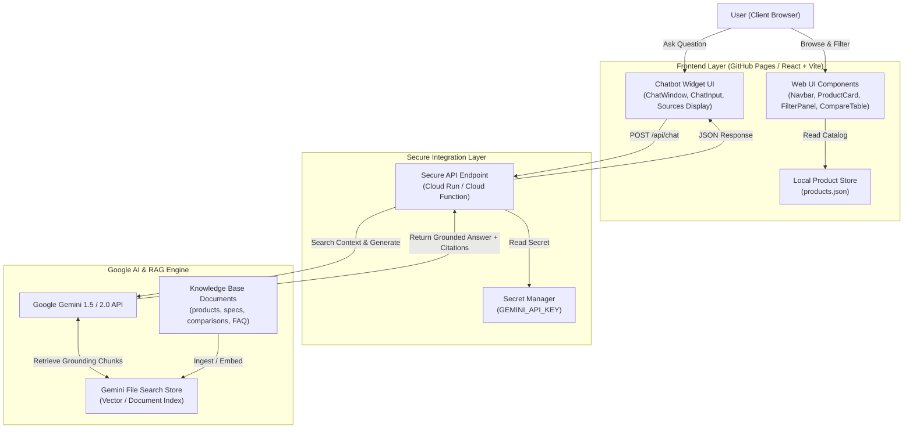
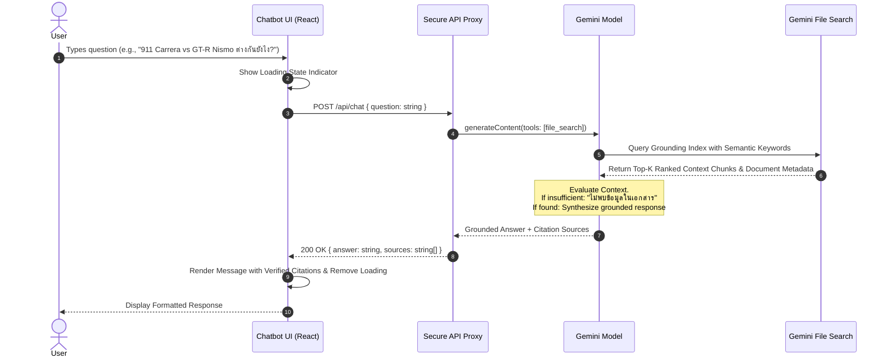

# System Architecture & RAG Flow Diagram

## 1. High-Level Architecture Diagram

```mermaid
graph TD
    User["User (Client Browser)"]
    
    subgraph "Frontend Layer (GitHub Pages / React + Vite)"
        UI["Web UI Components<br/>(Navbar, ProductCard, FilterPanel, CompareTable)"]
        ChatbotUI["Chatbot Widget UI<br/>(ChatWindow, ChatInput, Sources Display)"]
        LocalData["Local Product Store<br/>(products.json)"]
    end
    
    subgraph "Secure Integration Layer"
        BackendProxy["Secure API Endpoint<br/>(Cloud Run / Cloud Function)"]
        EnvSecret["Secret Manager<br/>(GEMINI_API_KEY)"]
    end
    
    subgraph "Google AI & RAG Engine"
        GeminiAPI["Google Gemini 1.5 / 2.0 API"]
        FileSearch["Gemini File Search Store<br/>(Vector / Document Index)"]
        KBFiles["Knowledge Base Documents<br/>(products, specs, comparisons, FAQ)"]
    end

    User -->|Browse & Filter| UI
    UI -->|Read Catalog| LocalData
    User -->|Ask Question| ChatbotUI
    ChatbotUI -->|POST /api/chat| BackendProxy
    BackendProxy -->|Read Secret| EnvSecret
    BackendProxy -->|Search Context & Generate| GeminiAPI
    GeminiAPI <-->|Retrieve Grounding Chunks| FileSearch
    KBFiles -->|Ingest / Embed| FileSearch
    GeminiAPI -->|Return Grounded Answer + Citations| BackendProxy
    BackendProxy -->|JSON Response| ChatbotUI
```

---

## 2. RAG Chatbot Request Flow Sequence

```mermaid
sequenceDiagram
    autonumber
    actor User as User
    participant UI as Chatbot UI (React)
    participant API as Secure API Proxy
    participant Gemini as Gemini Model
    participant KB as Gemini File Search

    User->>UI: Types question (e.g., "911 Carrera vs GT-R Nismo ต่างกันยังไง?")
    UI->>UI: Show Loading State Indicator
    UI->>API: POST /api/chat { question: string }
    API->>Gemini: generateContent(tools: [file_search])
    Gemini->>KB: Query Grounding Index with Semantic Keywords
    KB-->>Gemini: Return Top-K Ranked Context Chunks & Document Metadata
    Note over Gemini: Evaluate Context.<br/>If insufficient: "ไม่พบข้อมูลในเอกสาร"<br/>If found: Synthesize grounded response
    Gemini-->>API: Grounded Answer + Citation Sources
    API-->>UI: 200 OK { answer: string, sources: string[] }
    UI->>UI: Render Message with Verified Citations & Remove Loading
    UI-->>User: Display Formatted Response
```
